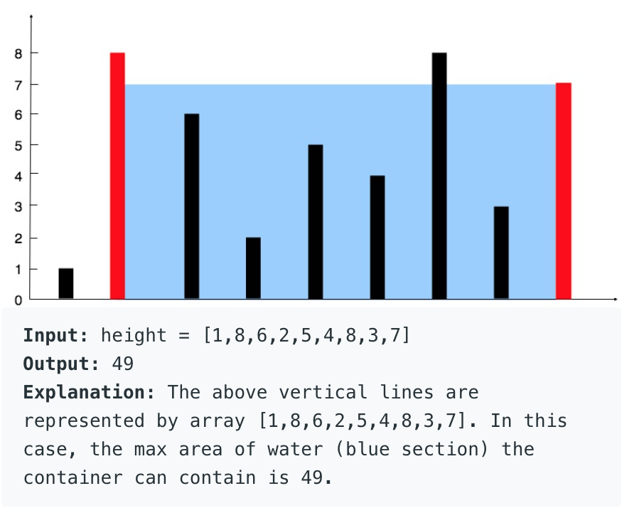

**Prompt:** Given a list of heights [a0 , a1 , a3 , … , an], find two heights that create a container that gives the maximum volume of water with the width of the container being the index of the first height to the index of the second height.

**Goal:** Find the maximum volume of all possible containers. 

{: .box-note}
**Note:**
The minimum height of the two height is a bottleneck of the volume

{: .box-note}
**Note:**
Volume = width * height = abs(index_1 - index_2) * min(height_1, height_2)

Example: 

**Solution:** Use two pointers, one at the start of the array and one at the end of the array. Then, you can calculate the volume and compare and update the old volume if the new volume is greater than the old volume. Then, you can increase the first pointer or decrease the second pointer depending whether the first height is less than the second height or second height is less than the first height. The stop condition should be when the first pointer is greater than or equal to the second pointer.

