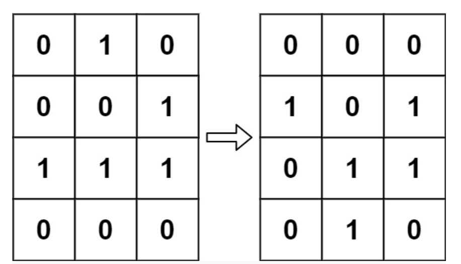
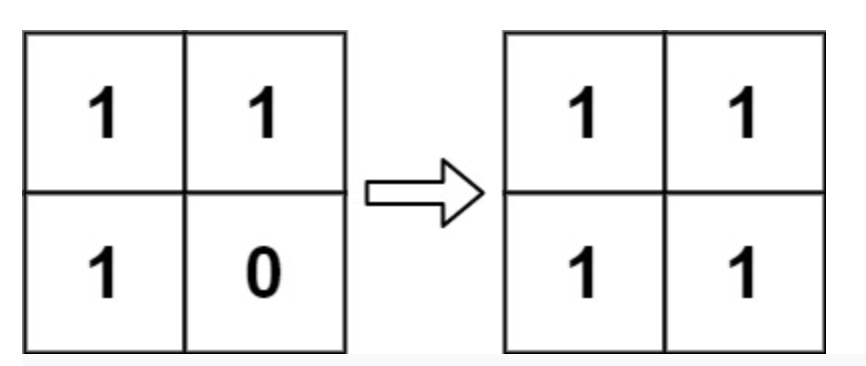

**Prompt:** Given an **m x n** array that represents the game of life, return the next state of the mxn array. This should be done in-place.

{: .box-note}
**Note:** There are 4 rules in the game of life. They all depend on the number of alive neighbors. Neighbors can be horizontal, vertical, or diagonal to the current grid.

**4 Rules:**  
1. n < 2, die  
2. 2 <= n <= 3, live  
3. n > 3, die  
4. n == 3, live  

{: .box-note}
**Note:** n is the number of neighbors

**Goal:** Return the next state of the game of life for the **m x n** array

Examples:
  

**Solution:** A simple solution would be to have an answer array that is the same size as the **m x n** array. The reason to do this is because we must simultaneously change the state of all cells. This basically restricts us from changing the original mxn array since we need all other cells to be unchanged in order to count the neighbors. 

Then, we can just count the neighbors of each cell in position i,j, decide if it lives or dies, and put the result in the i,j cell of the copied mxn array. Finally, you can copy and paste the copied mxn to the original mxn to make this implementation in-place.

Note: An easy way to count the number of neighbors is to create index changes of all the 8 possible neighbors and just restrictions for index errors.

Example of index changes:

d  = ((0,1), (1,1), (1,0), (1, -1), (-1, 0), (-1, -1), (0,-1), (-1, 1))

