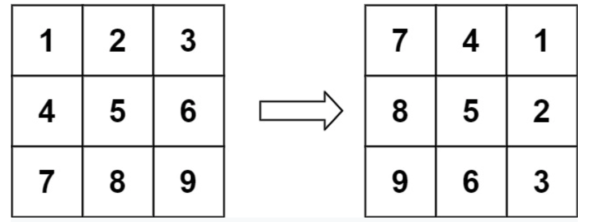

**Prompt:** Given an nxn array that represents the pixels on an image. You want to get the same image that is rotated 90 degrees from right to left. 

**Goal:** Return a nxn array that is rotated 90 degrees from right to left

Examples:
  

**Solution:** A 90 degrees rotation from right to left is the same thing as flipping all the pixels diagonally and flipping all the pixels horizontally.

Example: 

**x** o o  
o **x** o  
o o **x**  
The x’s will be the line where each side flips diagonally.

o **x** o  
o **x** o  
o **x** o  
The x’s will be the line where each side flips vertically.

