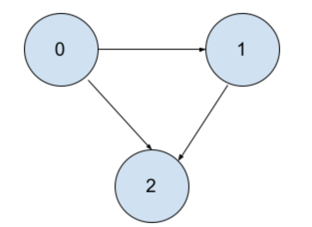
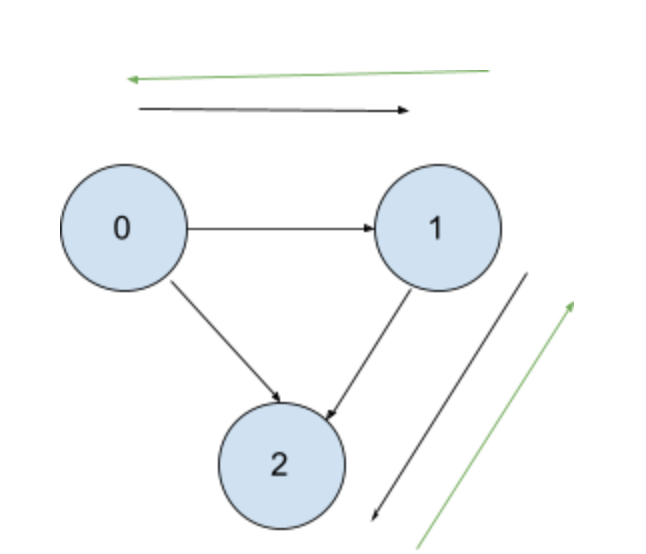
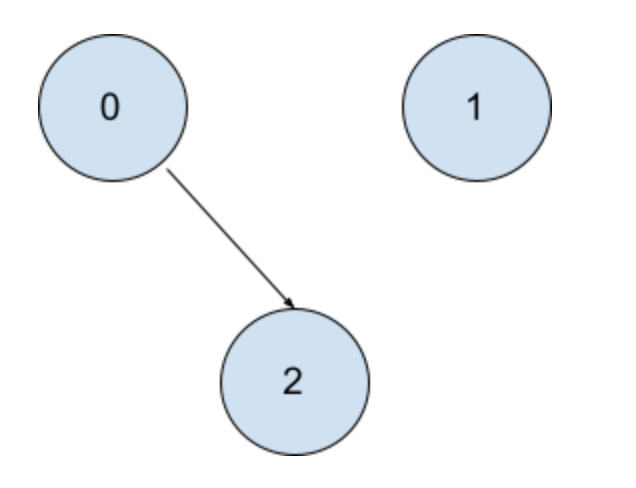
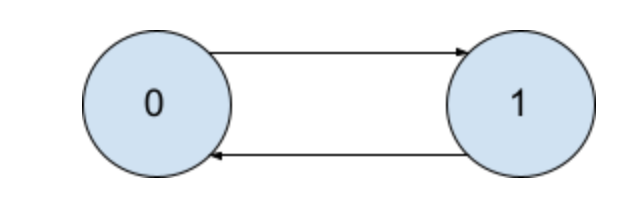
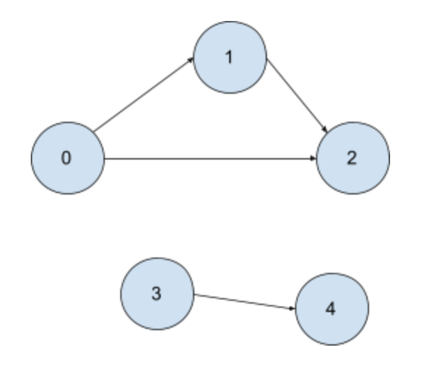

**Prompt:** There are **n** numbers of courses you need to take. Each course is represented by an integer id from 0 to n-1. There is also a list of prerequisites represented by an 2xn array, [[a0,b0],[a1,b1],[a2,b2],...,[an-1,bn-1]], where bi is a prerequisite of ai . Given **n** number of courses, is it possible to take all courses?

Example:

~~~
Input: numCourses = 2, prerequisites = [[1,0]]
Output: true
Explanation: There are a total of 2 courses to take. 
To take course 1 you should have finished course 0. So it is possible.
~~~  
~~~
Input: numCourses = 2, prerequisites = [[1,0],[0,1]]
Output: false
Explanation: There are a total of 2 courses to take. 
To take course 1 you should have finished course 0, and to take course 0 you should also have finished course 1. So it is impossible.
~~~

**Solution:** This is a dfs solution with backtracking. All of the prerequisites act like an directed edge for a graph. We need to look at the base cases of **True** and **False**, when you are able to take a course and when you are not able to take a course.  

Let's first look at the **True** case, when you are able to take a course.

If prerequisites are [[0,1],[0,2],[1,2]], then

~~~
Graph = 
{
    0: [1,2]
    1: [2]
    2: [ ]
}
~~~

Notice that all courses that are free to take are empty lists. Course 2 is free to take since it doesn’t have any prerequisites. Hence, we can do a dfs from 0 to all the edges. 

Let first dfs to the first prerequisite from 0, then dfs from 1 to 2. Finally, 2 doesn’t have a prerequisite so it returns True to 1 and to 0. 

Since we don’t need to dfs from 0 to 1 and from 1 to 2, we can delete those edges. Then we can just repeat for all prerequisites.

Now that we have taken care of the **True** case. We have to see the **False** case, when you are not able to take the course.

If prerequisites are [[0,1],[1,0]], then

~~~
Graph: 
{
    0: [1]
    1: [0]
}
~~~

An example **False** case is there is a loop in a current path. How do you find a loop? We can have a set where it keeps all of its visited courses. If it visits a course twice, it means that there’s a loop in which the current combination of courses cannot be taken. 

Pseudocode:


DFS(course):
	If course is in visited set:
		Return False
	If graph[course] is empty:
		Return True
	
	Add course to visited set

	For each prerequisite in graph[course]:
		If not DFS(course):
			// if we can’t take one of the prerequisite courses, then we can’t take the current course
			Return False
	
	Remove course from visited set so other courses can visit it 
	Remove all prerequisites for the current course, you don’t need to check it anymore

	// if we can take all prerequisite courses, then we can take the current course
Return True



One more edge case that we have to think about is whether all nodes in the graph are **connected or not**. If the graph is **not connected**, all we have to do is to run the DFS function for all courses.

Example:

 
