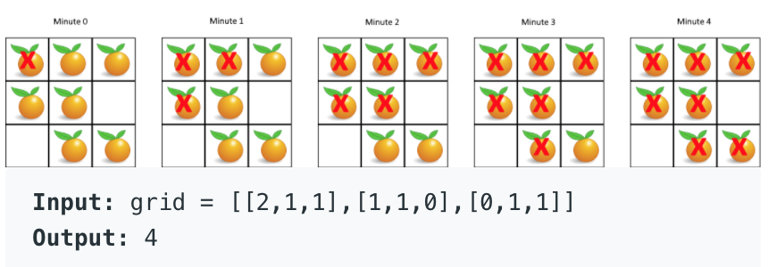

**Prompt:** Given an **mxn** 2D array, each value is an integer that is either **0, 1, or 2**. **0** represents an empty space. **1** represents a fresh orange. **2** represents a rotted orange. Moreover, if a fresh orange is next to a rotted orange, **either horizontally or vertically**, it will also rot within an minute. With the **mxn** 2D array, how many minutes does it take to rot all oranges? If it is not possible to rot all oranges, return **-1**.

**Goal:** Return the number of minutes it takes to rot all oranges. Return **-1** if oranges can not be rotted. 

Example:

**Solution:** This is like a game of life or BFS problem. 

We need to stop at a state when all fresh oranges are gone or when you can’t rot any orange while there are fresh oranges. 

Since all oranges simultaneously rots within a minute, we need to make a copy of the **mxn** array and store the results of the rotten oranges in there so that previous oranges that we rotted don't affect later oranges down the line. 

Once we have the copy, we just loop through the **mxn** array and decide which orange to rot by applying the rules. 

Then, we just store the result into the copied **mxn** array and increment the minute. 

If there are no more fresh oranges, we can return the minute. If there are no oranges to rot while there are still fresh oranges, return **-1**.
