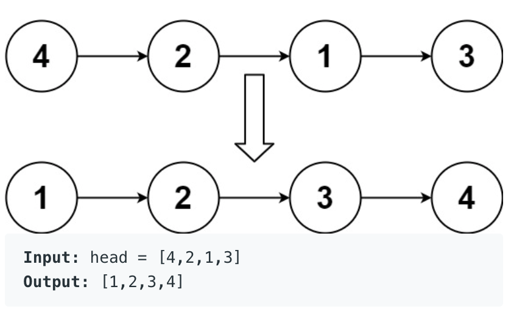
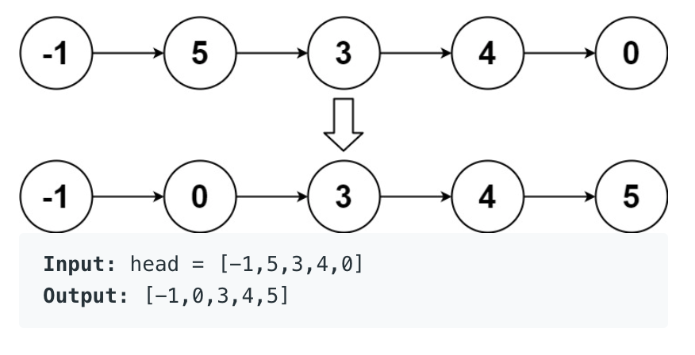

**Prompt:** Given a head node to a linked list of integers, return a head node to a linked list that is the sorted version of the given linked list.

Example:

**Solution:**

One simple solution is to go through the linked list and save all the integers in a list. Then, you can sort the list and return a reconstructed linked list. The runtime for this would be **O(n)** since you have to go through the **n** nodes for the scanning and also the reconstruction. The space complexity would be **O(n)** because you’re storing the scanned integers in a list. 

Another solution is top down merge sort. The runtime would be **O(n log n)** and the space complexity would be **O(1)** since we need a dummy head node so we can split when we recurse. 
