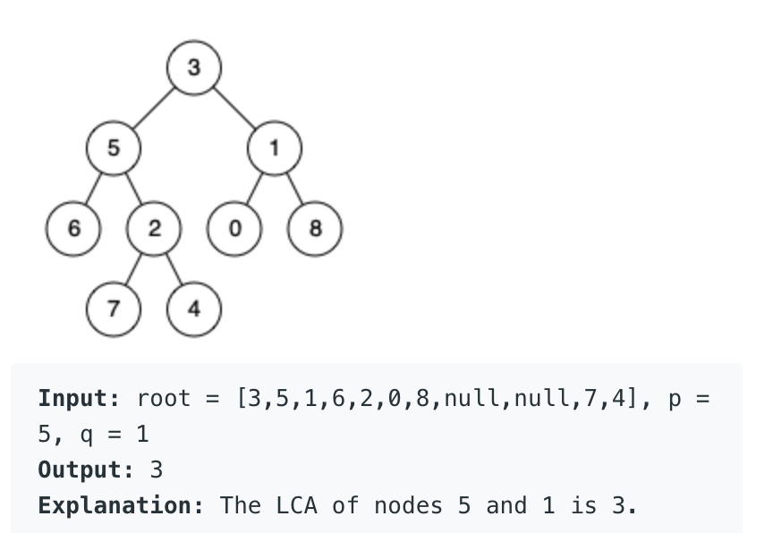
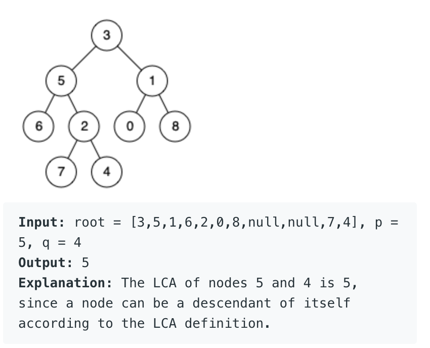

**Prompt:** Given a binary tree and two nodes from the tree, find the lowest common ancestor, LCA. 

{: .box-note}
**Note:** According to the definition of [LCA on Wikipedia](https://en.wikipedia.org/wiki/Lowest_common_ancestor): “The lowest common ancestor is defined between two nodes p and q as the lowest node in T that has both p and q as descendants (where we allow a node to be a descendant of itself).”

Example:

**Solution:** This can be solved using DFS to find the paths to both nodes. Then, we can find the latest node that both paths have in common. The run time for this would be **O(log n)** because of the DFS and Binary Tree.
