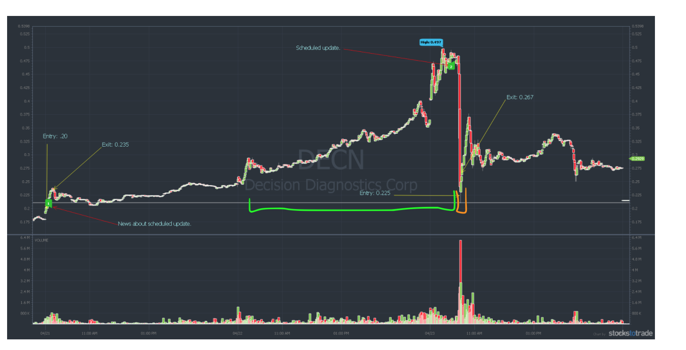

**Idea:** This pattern is **indicated by a multi-day runner** and into a steep dip. Then, you can buy at the potential bottom of the dip in order to profit the bounce. Or you can short before the dip.

{: .box-note}
**Note:** The term runner is when the stock price is greater than the stock price of the previous day. Hence, a multi-day runner is a stock that is consecutively increasing in value over multi days.

{: .box-note}
**Note:** Longer multi-day runner = bigger dip

Example:

<figcaption align = "center"><i>DECN Chart from April 21-23, 2021</i> <i>The green range labels that it’s a multiday runner. The orange range labels the dip.</i></figcaption>

**Why:** Why does this pattern exist?
1. Company does an offering to sell more stocks to gain more money. 
    * This usually means that the company is not doing so hot. The price will dip but it’s not because of a panic, it’s because the company is adding stock/supply. When supply increases, price decreases. DO NOT DIP BUY THIS because there is no bounce. The price dip is due to the stock losing value, not a panic. 
2. Sell the News
    * Since the stock is a multi-day runner, traders will think that good news is coming from the stock but the company just hasn't announced it yet. So traders would think “I want to sell this stock when there is good news before it goes back down to normal”.
3. Stock got overpriced
    * New traders have stop losses and sells when the stock got to a certain price
4. Short sellers are doing a short squeeze. 
    * A short squeeze occurs when short sellers trigger a rise in price on a heavily shorted stock. It’s a rapid increase in the price of a stock due to a lack of supply and an excess of demand for the stock due to short sellers covering (liquidating) their positions. In order to close out their short positions, the sellers are forced to buy to cover, creating heavy demand.

**Execution:**
1. Watch for level 2 (ask/bid price)
    * ask = minimum price where sellers are willing to sell
    * bid = maximum price where buyers are willing to buy
    * You’re looking for a **wall of buyers**. They are the ones that would bounce the price.
2. Watch for the previous support level. 
    * This is potentially where the bounce/bottom is.

