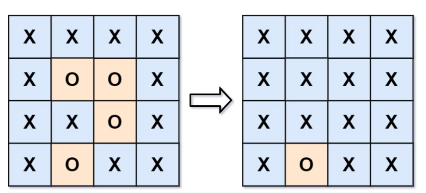

**Prompt:** Given an **m x n** grid, each cell contains a “X” or “O”. Can you capture all the “O” that are surrounded by “X”. To capture the surrounded “O”s, we need to turn them into “X”. 

Example:

**Solution:** This is a simple search problem. We know that all edge “O” cells are not capturable. Since these cells are not capturable, we also know that the cluster of an uncapturable cell is also uncapturable. Now if we can find all clusters of uncapturable “O” cells then we know that all other “O” cells are capturable. Finally, we just need to turn all the capturable “O” cells into “X”.
