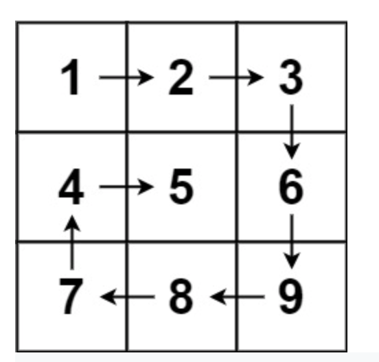
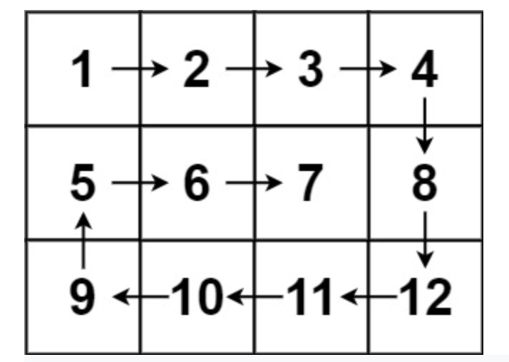

**Prompt:** Given an **m x n** array, return all the elements in a ***spiral*** order.

Example:

~~~
Input: matrix = [[1,2,3],[4,5,6],[7,8,9]]
Output: [1,2,3,6,9,8,7,4,5]
~~~

~~~
Input: matrix = [[1,2,3,4],[5,6,7,8],[9,10,11,12]]
Output: [1,2,3,4,8,12,11,10,9,5,6,7]
~~~

**Solution:** A very simple shaving solution can be implemented. We can shave the matrix in the order of top row, right column, bottom row, and left column. Then, we can repeat if there are still elements in the matrix. For the bottom row and left column shave, we have to reverse what is shaved.

