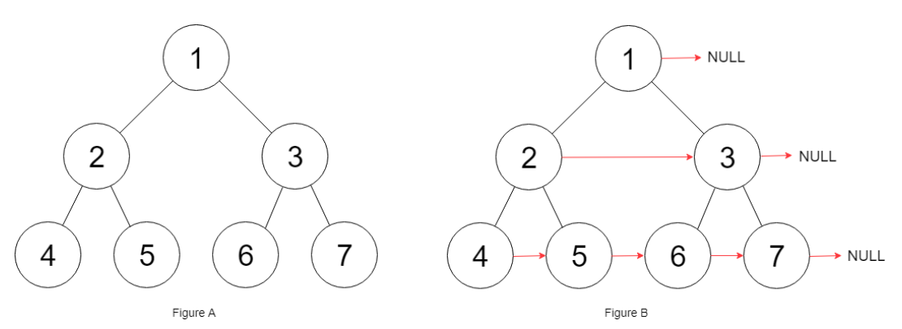

**Prompt:** Given a ***perfect binary tree*** and each node has a next pointer, populate each next pointer to point to its next right node. If there is no next right node, the next pointer should set to **NULL**.

{: .box-note}
**Note:** A ***perfect binary tree*** is where all leaves are on the same level, and every parent has two children.

Example:

~~~
Input: root = [1,2,3,4,5,6,7]
Output: [1,#,2,3,#,4,5,6,7,#]
Explanation: Given the above perfect binary tree (Figure A), your function should populate   each next pointer to point to its next right node, just like in Figure B. The   serialized output is in level order as connected by the next pointers, with '#' signifying   the end of each level.
~~~

**Solution:** This can be solved using BFS. Since BFS visits all nodes on the same level we can just connect all nodes to the right node before moving on to the next iteration of BFS.

