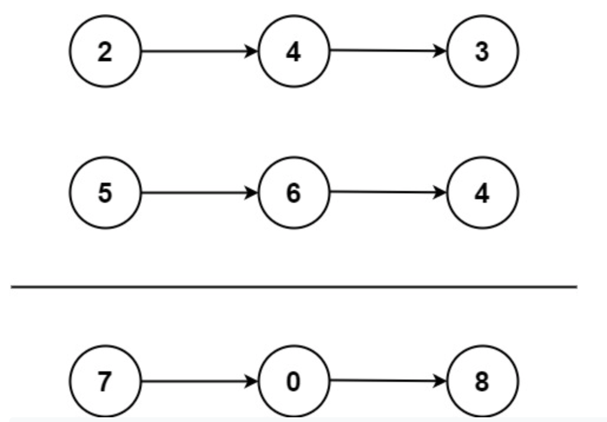

**Prompt:** Given two linked lists, each linked list represents a number and each node is a single digit within that number. The number value of each linked list is reversed. The goal is to return the sum of the number values between the two linked lists.

Example:

~~~
Input: l1 = [2,4,3], l2 = [5,6,4]
Output: [7,0,8]
Explanation: 342 + 465 = 807.
~~~

~~~
Input: l1 = [0], l2 = [0]
Output: [0]
~~~

~~~
Input: l1 = [9,9,9,9,9,9,9], l2 = [9,9,9,9]
Output: [8,9,9,9,0,0,0,1]
~~~

**Solution:** We can traverse through the linked lists and get the number values. Then, we can sum the two number values and recreate another linked list for the result value. And we can return that. The runtime for this solution is **O(n)** because the operations are linear.