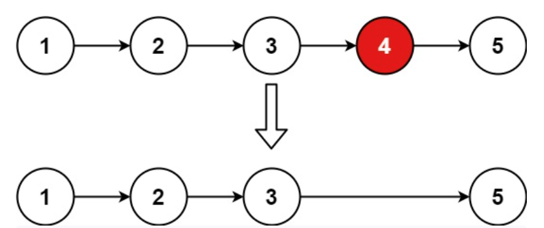

Prompt: Given a linked list, remove the ***n*th** node from the end of the list.

Example: 

~~~
Input: head = [1,2,3,4,5], n = 2
Output: [1,2,3,5]
~~~
~~~
Input: head = [1], n = 1
Output: []
~~~
~~~
Input: head = [1,2], n = 1
Output: [1]
~~~

**Solution:** We can traverse all linked nodes and store them in a list. Then, we can change the next value of the ***n*th** node at the end of the list. The runtime for this solution is **O(n)**.