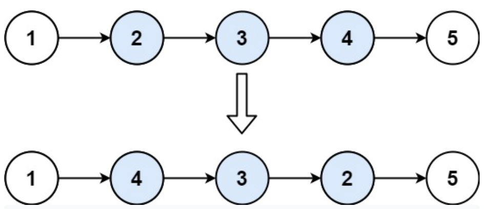

**Prompt:** Given a linked list’s head and two integers, left and right, return the linked list where the nodes from left to right are reversed. The constraints on left and right is **left <= right**.

Example:

~~~
Input: head = [1,2,3,4,5], left = 2, right = 4
Output: [1,4,3,2,5]
~~~
~~~
Input: head = [5], left = 1, right = 1
Output: [5]
~~~

**Solution:** First, we can try to imagine most situations. If left is equal to right, then we don’t have to do anything. If left is not equal to right, then we can just traverse through the linked list and store all it’s nodes in a list. Then, we can just reverse the nodes from index right to left. Finally we can just reconnect all the nodes and return the head.

The runtime for this solution is **O(n)**. 

