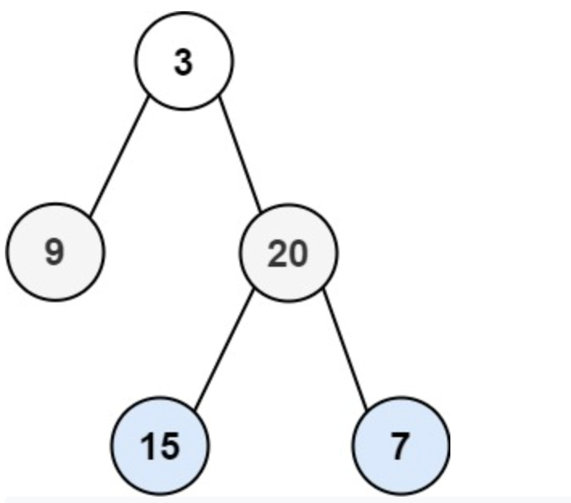

**Prompt:** Given a binary tree’s root node, return all levels of the binary tree in list form.

Example: 

~~~
Input: root = [3,9,20,null,null,15,7]
Output: [[3],[9,20],[15,7]]
~~~
~~~
Input: root = [1]
Output: [[1]]
~~~
~~~
Input: root = []
Output: []
~~~

**Solution:** We can solve this with BFS where we access from left to right nodes. The runtime for this is **O(n)** since we have to traverse through all nodes.
