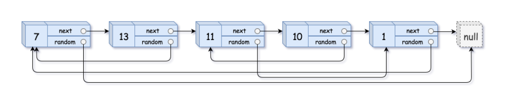

**Prompt:** You are given a linked list with length n. Each node has a val, a pointer to the next node, and a pointer to a random node in the list or None. Return a deep copy of this linked list.

Example:

~~~
Input: head = [[7,null],[13,0],[11,4],[10,2],[1,0]]
Output: [[7,null],[13,0],[11,4],[10,2],[1,0]]
~~~

~~~
Input: head = [[1,1],[2,1]]
Output: [[1,1],[2,1]]
~~~

~~~
Input: head = [[3,null],[3,0],[3,null]]
Output: [[3,null],[3,0],[3,null]]
~~~

**Solution:** We can solve this problem with a simple ordered dictionary. First, we can loop through the nodes in the original list and store a key value pair in the ordered dictionary. The key is the current node that is looped on to. The value is a list of the index of the current node and it’s random node pointer. The key can be used to access the random pointer of another node. The index can be used to reference a random pointer in the deep copy linked list.

Then, we can use a list **A** to store all the new nodes for the deep copy. Since all the nodes are stored in an ordered dictionary. We can just loop through the dictionary and add a new node to the list **A**. In the new node, we can store the value of the current node and the random node’s index value as the random pointer. We can also set the last node in list **A** to have the next pointer point to the new node before adding the new node in list **A**. 

Finally, we can loop through list **A** and update the random pointer. Since the current random pointer is the index of the random pointer node, we can just replace the random pointer with the node at the random pointer index in list **A**. The head of the deep copy, which is the very first element of the list, should be returned as the answer. 

The runtime for this solution is **O(n)**.

