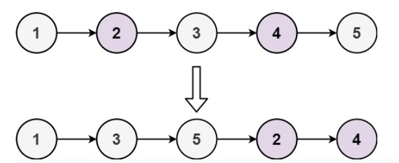
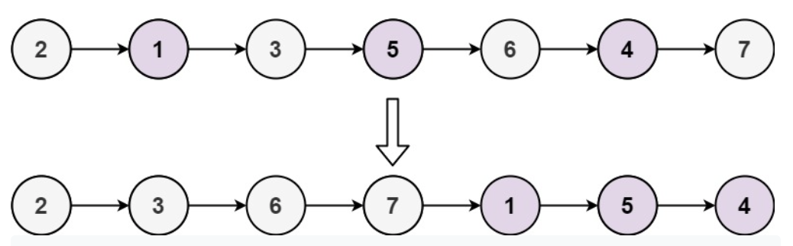

**Prompt:** Given a linked list, reorder the linked list such that the first half of the linked list are the odd nodes and the last half are the even nodes. 

Example:

~~~
Input: head = [1,2,3,4,5]
Output: [1,3,5,2,4]
~~~

~~~
Input: head = [2,1,3,5,6,4,7]
Output: [2,3,6,7,1,5,4]
~~~

**Solution:** We can solve this by saving the previous traversed node and the second node. When we traverse to each node, we have to save the current node as the previous node and traverse to the next node. Then, we can set the previous node’s next node as the current node. By traversing the linked list this way, we can travel the linked list as normal and relink all nodes by their next next nodes. Finally, we just need to connect the last node of the original list with the second node that we saved earlier. We also got to make sure that the last element of the even list is None to avoid any cycles. The runtime of this solution is **O(n)**.